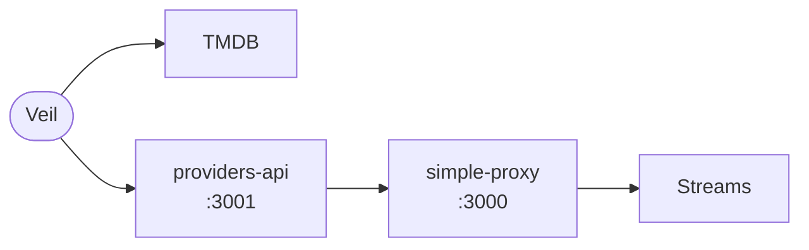

<p align="center">
  
</p>

<h1 align="center">Veil</h1>

<p align="center">
  <strong>Browse. Resolve. Watch — on your Android device.</strong>
</p>

<p align="center">
  <a href="https://github.com/dikshadamahe/veil-android"></a>
  &nbsp;
  
  &nbsp;
  
</p>

---

> **Aggregator only.** Veil does not host video, store media, or act as a CDN. It connects your TMDB catalog and your own resolver stack to playback in **media_kit**.

---

## At a glance

**Discover** — Trending & search, movies & TV, detail pages; posters and metadata from **TMDB**.

**Play** — In-app player with resume, bookmarks, continue watching, subtitles, and adaptive controls.

**Resolve** — Live scrape (**SSE**) or blocking calls to **providers-api**; optional **simple-proxy** when CDNs need a friendly hop.

Screens follow the **[xp-technologies-dev/p-stream](https://github.com/xp-technologies-dev/p-stream)** web reference (Flutter widgets mapped from the original `.tsx` sources).

---

## Flow



| | |
|:---|:---|
| **API** | [`backend/providers-api`](backend/providers-api/README.md) · Express + `@p-stream/providers` |
| **Package** | [`xp-technologies-dev/providers`](https://github.com/xp-technologies-dev/providers) |
| **Proxy** | [`xp-technologies-dev/simple-proxy`](https://github.com/xp-technologies-dev/simple-proxy) *(optional)* |
| **Embeds** | [Custom integration](backend/providers-api/docs/CUSTOM_EMBED_INTEGRATION.md) |

---

## Stack

Flutter · Riverpod · go_router · Hive · media_kit · Node **20** / **pnpm** (resolver)

---

## Backend

```bash
cd backend/providers-api && pnpm install && pnpm start
```

`curl http://127.0.0.1:3001/health` — listens on **3001** by default.

---

## Build

Secrets stay out of source: pass **`--dart-define`** at build time. Prefer **HTTPS** in production.

```bash
flutter pub get
dart run flutter_launcher_icons   # optional — syncs launcher from logo-circle.png
flutter build apk --release \
  --dart-define=ORACLE_URL=http://YOUR_HOST:3001 \
  --dart-define=TMDB_TOKEN=YOUR_TMDB_READ_TOKEN
```

CI runs **`flutter analyze`**, **`dart run flutter_launcher_icons`**, then the release APK with the same defines — configure **`ORACLE_URL`** and **`TMDB_TOKEN`** (or **`TMDB_READ_TOKEN`**) in GitHub variables or secrets.

<details>
<summary><strong>Optional defines</strong> — subtitles, scrape order</summary>

| Define | Purpose |
|--------|---------|
| `SCRAPE_SOURCE_ORDER` | Comma-separated source `id`s from `GET /sources` (see backend README). |
| `WYZIE_API_KEY` | Wyzie subs — **Search online…** in the player. |
| `OPENSUBTITLES_API_KEY` | OpenSubtitles REST key. |
| `OPENSUBTITLES_USERNAME` / `OPENSUBTITLES_PASSWORD` | Account pairing when the API key alone is not enough. |
| `SUBTITLE_HTTP_USER_AGENT` | Override UA for subtitle fetches (default `Veil 1.0.0`). |

</details>

---

## Repo layout

| Path | Role |
|------|------|
| `backend/providers-api/` | Resolver API + operator docs |
| `lib/` | Flutter app |
| `android/` | Gradle, manifest, launcher assets |

---

## Disclaimer

Veil is a **metadata and playback orchestration** tool. You are responsible for backend configuration, provider and TMDB terms, and compliance with applicable law.
