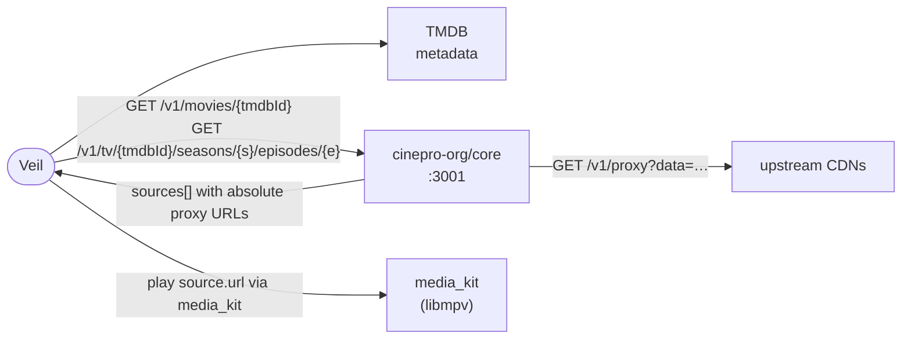

<p align="center">
  
</p>

<h1 align="center">Veil</h1>

<p align="center">
  <strong>Browse. Resolve. Watch — on your Android device.</strong>
</p>

<p align="center">
  <a href="https://github.com/dikshadamahe/veil-android"></a>
  &nbsp;
  
  &nbsp;
  
</p>

---

> **Aggregator only.** Veil does not host video, store media, or act as a CDN. It connects your TMDB catalog to playback in **media_kit** by asking a self-hosted **cinepro-org/core** resolver for every playable source it can find.

---

## At a glance

**Discover** — Trending & search, movies & TV, detail pages; posters and metadata from **TMDB**.

**Play** — In-app player with resume, bookmarks, continue watching, subtitles, and adaptive controls.

**Resolve** — One HTTP call to the self-hosted **cinepro-org/core** resolver returns every source that has the title, with the playable URL already proxied. The app hands `source.url` straight to **media_kit** — no client-side scraping, no per-provider WebView hooks, no SSE pipeline.

Screens follow the **[xp-technologies-dev/p-stream](https://github.com/xp-technologies-dev/p-stream)** web reference (Flutter widgets mapped from the original `.tsx` sources).

---

## Flow



| | |
|:---|:---|
| **Backend** | [`cinepro-org/core`](https://github.com/cinepro-org/core) — self-hosted **OMSS v1.0** resolver on port `3001` |
| **Providers** | 14 built-in: CineSu, FshareTV, Icefy, Peachify, Popr, MafiaEmbed, Tulnex, VidApi, Videasy, VidNest, VidRock, VidSrc, VidZee, VixSrc |
| **Proxy** | Provided by cinepro — `GET /v1/proxy?data={base64url}` |

---

## Stack

Flutter · Riverpod · go_router · Hive · media_kit · TMDB · cinepro-org/core (OMSS v1.0)

---

## Backend

The resolver is **cinepro-org/core** (OMSS v1.0). It listens on **port 3001** and exposes a small, fixed API:

```bash
# status
curl http://127.0.0.1:3001/v1/health

# movie sources
curl 'http://127.0.0.1:3001/v1/movies/550'

# TV episode sources
curl 'http://127.0.0.1:3001/v1/tv/1399/seasons/1/episodes/1'
```

A successful response:

```json
{
  "responseId": "5b3e…",
  "expiresAt": "2026-06-05T18:30:00Z",
  "sources": [
    {
      "url": "http://127.0.0.1:3001/v1/proxy?data=eyJ…",
      "type": "hls",
      "quality": "1080p",
      "audioTracks": [{ "language": "en", "label": "English" }],
      "provider": { "id": "vidsrc", "name": "VidSrc" }
    }
  ],
  "subtitles": [
    {
      "url": "http://127.0.0.1:3001/v1/proxy?data=…",
      "label": "English",
      "format": "vtt"
    }
  ],
  "diagnostics": []
}
```

`source.url` is already an **absolute proxy URL** — the Flutter app hands it straight to `media_kit`. The proxy handles `Referer` / `Origin` / `User-Agent` server-side; the app does not need to inject any headers.

---

## Build

Secrets stay out of source: pass **`--dart-define`** at build time. Prefer **HTTPS** in production.

```bash
flutter pub get
dart run flutter_launcher_icons   # optional — syncs launcher from logo-circle.png
flutter build apk --release \
  --dart-define=ORACLE_URL=http://YOUR_HOST:3001 \
  --dart-define=TMDB_TOKEN=YOUR_TMDB_READ_TOKEN
```

CI runs **`flutter analyze`**, **`dart run flutter_launcher_icons`**, then the release APK with the same defines — configure **`ORACLE_URL`** and **`TMDB_TOKEN`** (or **`TMDB_READ_TOKEN`**) in GitHub variables or secrets.

<details>
<summary><strong>Optional defines</strong> — subtitles, watch rules</summary>

| Define | Purpose |
|--------|---------|
| `WYZIE_API_KEY` | Wyzie subs — **Search online…** in the player. |
| `OPENSUBTITLES_API_KEY` | OpenSubtitles REST key. |
| `OPENSUBTITLES_USERNAME` / `OPENSUBTITLES_PASSWORD` | Account pairing when the API key alone is not enough. |
| `SUBTITLE_HTTP_USER_AGENT` | Override UA for subtitle fetches (default `Veil 1.0.0`). |
| `WATCHED_RATIO` | `position / duration` ratio that marks a title as watched (default `0.90`). |

</details>

---

## Repo layout

| Path | Role |
|------|------|
| `lib/` | Flutter app |
| `android/` | Gradle, manifest, launcher assets |
| `backend/` | **Legacy** — old `providers-api` (Express) + `providers-lib` (TypeScript sourcerers). The active resolver is the cinepro-org/core service running on the VM, **not** this folder. Kept for reference; safe to delete once a downstream migration is confirmed. |

---

## Disclaimer

Veil is a **metadata and playback orchestration** tool. You are responsible for backend configuration, provider and TMDB terms, and compliance with applicable law.
