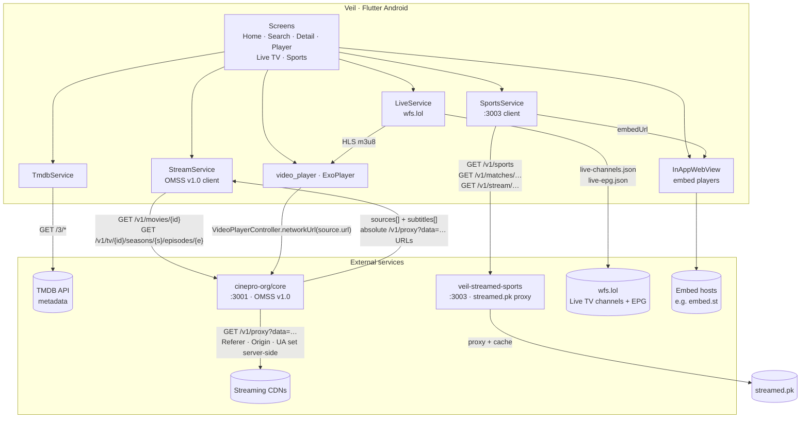
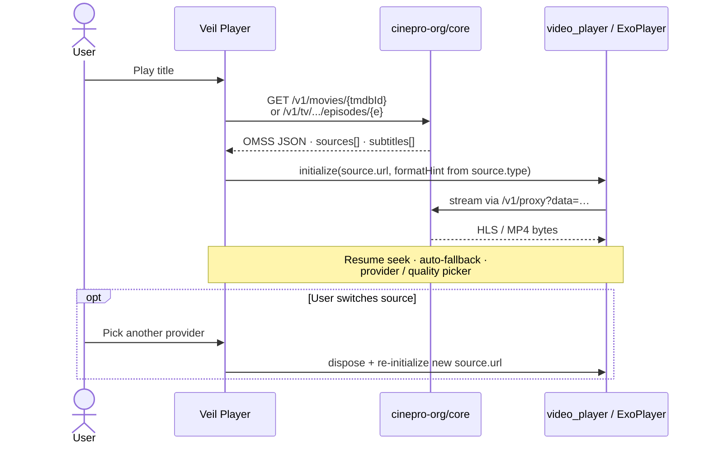

<p align="center">
  
</p>

<h1 align="center">Veil</h1>

<p align="center">
  <strong>Browse. Resolve. Watch — on your Android device.</strong>
</p>

<p align="center">
  <a href="https://github.com/dikshadamahe/veil-android"></a>
  &nbsp;
  
  &nbsp;
  
</p>

---

> **Aggregator only.** Veil does not host video, store media, or act as a CDN. It connects your TMDB catalog to in-app playback by asking a self-hosted **[cinepro-org/core](https://github.com/cinepro-org/core)** resolver for playable sources — then opens each `source.url` in **`video_player`** (ExoPlayer on Android).

---

## At a glance

| | |
|:---|:---|
| **Discover** | Trending, search, detail pages — posters and metadata from **TMDB** (direct from the app). |
| **Resolve** | One HTTP GET to **cinepro-org/core** returns every provider that has the title, with proxy URLs already absolute. No client-side scraping, WebView hooks, or SSE pipeline. |
| **Play** | The player fetches sources inline, auto-fallbacks on failure, and exposes provider-grouped source switching, quality variants, resume, continue watching, and optional online subtitles. |
| **Live TV** | Channel grid from public `wfs.lol` JSON — direct HLS in ExoPlayer, with optional EPG “now playing”. |
| **Sports** | Live / today / by-sport match browse via a self-hosted **streamed.pk** proxy (`:3003`). Streams are **iframe embeds** played in an in-app WebView (not ExoPlayer). |

UI follows the **[xp-technologies-dev/p-stream](https://github.com/xp-technologies-dev/p-stream)** web reference — Flutter widgets mapped from the original `.tsx` sources.

---

## Architecture



| Component | Role |
|-----------|------|
| **Flutter app** | TMDB browse + OMSS resolver client + Live TV + Sports + local Hive storage (progress, bookmarks, history). |
| **[cinepro-org/core](https://github.com/cinepro-org/core)** | Self-hosted **OMSS v1.0** resolver on port `3001`. Crawls 14 built-in providers and returns a populated `sources[]`. |
| **Proxy** | `GET /v1/proxy?data={base64url}` — headers injected server-side; the app never sets `Referer` / `Origin` / `User-Agent` per provider. |
| **veil-streamed-sports** | Isolated Express proxy on port `3003` for [streamed.pk](https://streamed.pk/docs) match listings and stream embeds. Does **not** share process or routes with cinepro. Source mirror: `backend/streamed-sports-api/`. |
| **Live TV** | Public `wfs.lol` channel + EPG JSON; playback is native HLS via ExoPlayer. |

**Built-in providers (VOD):** CineSu · FshareTV · Icefy · Peachify · Popr · MafiaEmbed · Tulnex · VidApi · Videasy · VidNest · VidRock · VidSrc · VidZee · VixSrc

---

## Playback flow

There is no separate “finding sources” screen. Tapping **Play** opens the player, which resolves sources and starts playback in one place — with inline loading, retry, and source switching.



---

## Stack

Flutter · Riverpod · go_router · Hive · video_player (ExoPlayer) · flutter_inappwebview · TMDB · cinepro-org/core (OMSS v1.0) · veil-streamed-sports

Adaptive shell: bottom nav with Home · Search · My list · Live TV · Sports · Settings (`windowClass` breakpoints for grid density).

---

## Backend API

### VOD resolver — cinepro-org/core (`:3001`)

The movie/TV resolver is **[cinepro-org/core](https://github.com/cinepro-org/core)** (OMSS v1.0) on **port 3001**:

```bash
# Health
curl http://YOUR_HOST:3001/v1/health

# Movie sources
curl 'http://YOUR_HOST:3001/v1/movies/550'

# TV episode sources
curl 'http://YOUR_HOST:3001/v1/tv/1399/seasons/1/episodes/1'
```

Example response:

```json
{
  "responseId": "5b3e…",
  "expiresAt": "2026-06-05T18:30:00Z",
  "sources": [
    {
      "url": "http://YOUR_HOST:3001/v1/proxy?data=eyJ…",
      "type": "hls",
      "quality": "1080p",
      "audioTracks": [{ "language": "en", "label": "English" }],
      "provider": { "id": "vidsrc", "name": "VidSrc" }
    }
  ],
  "subtitles": [
    {
      "url": "http://YOUR_HOST:3001/v1/proxy?data=…",
      "label": "English",
      "format": "vtt"
    }
  ],
  "diagnostics": []
}
```

`source.url` is already an **absolute proxy URL**. The player passes it to `VideoPlayerController.networkUrl` with a **`formatHint`** derived from OMSS `source.type` (HLS/DASH/etc.) because proxy URLs have no file extension for ExoPlayer to infer. Do not prepend `ORACLE_URL` or inject playback headers in the client.

### Sports — veil-streamed-sports (`:3003`)

Isolated Express proxy for [streamed.pk](https://streamed.pk/docs). Runs on **port 3003**; does not share process, port, or routes with cinepro. Local mirror: `backend/streamed-sports-api/`.

```bash
# Health
curl http://YOUR_HOST:3003/health

# Sport categories
curl http://YOUR_HOST:3003/v1/sports

# Live / today / by-sport matches
curl http://YOUR_HOST:3003/v1/matches/live
curl http://YOUR_HOST:3003/v1/matches/all-today
curl http://YOUR_HOST:3003/v1/matches/football

# Streams for a match source (returns embedUrl — iframe, not HLS)
curl http://YOUR_HOST:3003/v1/stream/echo/MATCH_SOURCE_ID
```

| Local | Upstream |
|-------|----------|
| `GET /health` | — |
| `GET /v1/sports` | `/api/sports` |
| `GET /v1/matches/live` · `/live/popular` | `/api/matches/…` |
| `GET /v1/matches/all` · `/all-today` · `/:sport` · `/:sport/popular` | `/api/matches/…` |
| `GET /v1/stream/:source/:id` | `/api/stream/:source/:id` |
| `GET /v1/images/*` | `/api/images/*` |

Stream objects include an **`embedUrl`** (iframe). The Sports tab opens that URL in an **InAppWebView** — the same idea as the XPass embed path for VOD — not ExoPlayer.

In-memory cache TTLs (env-overridable): sports ~1h, matches ~2m, live ~45s, streams ~20s.

---

## Build

Secrets stay out of source: pass **`--dart-define`** at build time. Prefer **HTTPS** for production resolver URLs.

```bash
flutter pub get
dart run flutter_launcher_icons   # optional — syncs launcher from logo-circle.png
flutter analyze
flutter build apk --release \
  --dart-define=ORACLE_URL=http://YOUR_HOST:3001 \
  --dart-define=SPORTS_URL=http://YOUR_HOST:3003 \
  --dart-define=TMDB_TOKEN=YOUR_TMDB_READ_TOKEN
```

**CI / releases:** pushing a `v*` tag (or manual **Release** workflow dispatch) runs `flutter analyze`, builds a **signed** `veil.apk`, and publishes a GitHub Release with `version.json` (for in-app updates).

Required repository secrets for signed releases:

| Secret | Purpose |
|--------|---------|
| `ORACLE_URL` (or variable) | VOD resolver base URL baked into the APK (`:3001`) |
| `TMDB_TOKEN` or `TMDB_READ_TOKEN` | TMDB read token |
| `ANDROID_KEYSTORE_BASE64` | Base64-encoded `.jks` / `.keystore` |
| `ANDROID_KEYSTORE_PASSWORD` | Keystore password |
| `ANDROID_KEY_ALIAS` | Key alias |
| `ANDROID_KEY_PASSWORD` | Key password |

**In-app updates:** Settings → **App** → **Check for updates** polls `dikshadamahe/veil-android` GitHub Releases. Newer APKs install on top of older ones when they share the same `applicationId` and signing certificate and the new `versionCode` is higher. Bump `version:` in `pubspec.yaml` (e.g. `1.0.3+4`) before each tagged release.

Generate a one-time upload keystore (do not commit it):

```bash
keytool -genkey -v -keystore upload-keystore.jks -keyalg RSA -keysize 2048 -validity 10000 -alias upload
base64 -w0 upload-keystore.jks   # paste into ANDROID_KEYSTORE_BASE64
```

<details>
<summary><strong>Optional defines</strong> — sports URL, subtitles, watch rules</summary>

| Define | Purpose |
|--------|---------|
| `SPORTS_URL` | Base URL for `veil-streamed-sports` (default in app config points at the public VM `:3003`). |
| `WYZIE_API_KEY` | Wyzie subs — **Search online…** in the player. |
| `OPENSUBTITLES_API_KEY` | OpenSubtitles REST key. |
| `OPENSUBTITLES_USERNAME` / `OPENSUBTITLES_PASSWORD` | Account pairing when the API key alone is not enough. |
| `SUBTITLE_HTTP_USER_AGENT` | Override UA for subtitle fetches (default `Veil 1.0.0`). |
| `WATCHED_RATIO` | `position / duration` ratio that marks a title as watched (default `0.90`). |

</details>

---

## Repo layout

| Path | Role |
|------|------|
| `lib/screens/` | Home, search, detail, player, live TV, sports, sports player, settings, history, my list |
| `lib/services/` | `tmdb_service.dart`, `stream_service.dart` (OMSS), `live_service.dart`, `sports_service.dart`, `app_update_service.dart` |
| `lib/models/` | `media_item.dart`, `omss_source.dart`, `live_channel.dart`, `sports_match.dart`, `match_stream.dart`, … |
| `lib/config/` | `app_config.dart`, `app_theme.dart`, `router.dart`, breakpoints |
| `lib/storage/` | Hive — progress, bookmarks, continue watching |
| `android/` | Gradle, manifest, launcher assets |
| `backend/streamed-sports-api/` | Source mirror of **veil-streamed-sports** (port `3003`) — deployable Express proxy for streamed.pk. |
| `backend/providers-api/` | **Legacy** — old providers stack. The active VOD resolver is **cinepro-org/core** on the VM, not this folder. Kept for reference. |

---

## Disclaimer

Veil is a **metadata and playback orchestration** tool. You are responsible for backend configuration, provider and TMDB terms, and compliance with applicable law.
